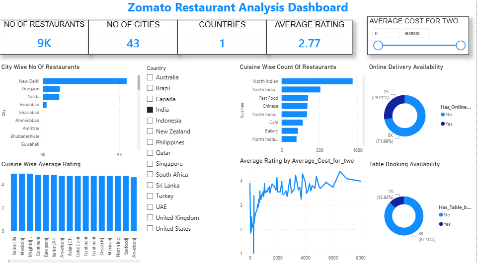

# 🍽️ Zomato Restaurant Analysis Dashboard

## 📊 Project Overview

The **Zomato Restaurant Analysis Dashboard** is an interactive data visualization project developed using **Microsoft Power BI**.

The project analyzes restaurant data based on factors such as city, cuisine, ratings, average cost for two people, table booking and online delivery availability.

The objective is to transform raw restaurant data into meaningful insights through data cleaning, data modeling, DAX calculations and interactive visualizations.

---

## 🎯 Objectives

* Analyze restaurant distribution across different cities
* Analyze restaurants based on cuisine
* Compare restaurant ratings
* Analyze average cost for two people
* Analyze table-booking availability
* Analyze online-delivery availability
* Create an interactive dashboard for business insights

---

## 🛠️ Tools & Technologies

* **Microsoft Power BI**
* **Power Query**
* **DAX**
* **Data Modeling**
* **Data Visualization**
* **CSV / Excel**

---

## 📁 Dataset

The dataset contains **9,551 restaurant records** and includes information such as:

* Restaurant ID
* Restaurant Name
* City
* Country Code
* Cuisines
* Rating
* Average Cost for Two
* Price Range
* Votes
* Table Booking
* Online Delivery

---

## 🔄 Project Workflow

```text
Raw Zomato Dataset
        ↓
Data Import
        ↓
Data Cleaning using Power Query
        ↓
Data Type Transformation
        ↓
Data Modeling
        ↓
DAX Measures
        ↓
Data Visualization
        ↓
Interactive Dashboard
```

---

## 📌 Key Power BI Features Used

### Power Query

* Data import
* Data cleaning
* Data type transformation
* Handling missing values
* Text formatting

### Data Modeling

* Restaurant data table
* Country lookup table
* Relationship using CountryCode

### DAX

Created measures for:

* Number of Restaurants
* Number of Cities
* Number of Countries
* Average Rating
* Average Cost for Two
* Restaurant Count

---

## 📊 Dashboard Visualizations

The dashboard includes:

* KPI Cards
* City-wise restaurant analysis
* Cuisine-wise restaurant analysis
* Cuisine-wise average rating
* Cost vs Rating analysis
* Table-booking availability
* Online-delivery availability
* Country slicer
* Average-cost slicer

---

## 🖥️ Dashboard Preview

### Main Dashboard


### Filtered Dashboard



---

## 💡 Key Insights

The dashboard can be used to:

* Identify cities with a high concentration of restaurants
* Understand the distribution of cuisines
* Compare restaurant ratings
* Analyze restaurant pricing
* Understand table-booking availability
* Analyze online-delivery availability
* Interactively filter restaurant information by country and cost

---

## 📂 Project Files

| File                              | Description                   |
| --------------------------------- | ----------------------------- |
| `Zomato_Restaurant_Analysis.pbix` | Power BI dashboard            |
| `Zomato_Dataset.csv`              | Source dataset                |
| `dashboard.png`                   | Dashboard screenshot          |
| `dashboard_filtered.png`          | Filtered dashboard screenshot |

---

## 🚀 Skills Demonstrated

* Power BI
* Power Query
* DAX
* Data Cleaning
* Data Modeling
* Data Visualization
* Dashboard Development
* Business Intelligence
* Data Analysis

---

## 👤 Author

**Vamshy Krishna**

Aspiring Data Analyst | Power BI | SQL | Python

---

⭐ If you find this project useful, feel free to explore the repository.
